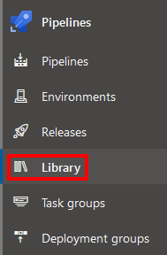

# SETUP Azure DevOps Pipeline library

## Get Azure Service Principal

Using Powershell as an Administrator, execute the **./azure-connect.ps1** script.
It is merely an helper to install the AZ CLI (if it's missing), connect you to your Azure Account, create and get an Azure Service Principal set of connection identifiers.

If you prefer, you can execute those 3 commands manually, just replace **\<AccountId>** with an account ID chosen among the first command result :

1. *az account list*
2. *az account set --subscription=**\<AccountId>***
3. *az ad sp create-for-rbac --role="Contributor" --scopes="/subscriptions/**\<AccountId>"***

Open the **./tf_examples/arm.credentials.dev.auto.tfvars.example** and replace the corresponding values.
Save this file and rename it **arm.credentials.dev.auto.tfvars** (remove the .example).

## Library Section

On Azure DevOps, go to the Library Section.

### Add a Secure file

In the Secure file section in the library, add a secure file.
When prompted, browse to the **arm.credentials.dev.auto.tfvars**, you just filled and renamed and validate.

### Variable Group Creation

Create a new **Variable Group** named **Backend-Resource-Names**.

Add these 3 variables and assign them a value :

1. **BackendContainerName** : the value can be any name (example : "tf-plans-container"),
2. **BackendResourceGroupName** : value must respect this pattern *rg-\<projectname\>-backend* (example : "rg-demotf-backend")
3. **BackendStorageAccountName** : value must respect this pattern *sa\<projectname\>* (example : "sademotf", only lower case or numbers, no specila characters).

## Pipelines

You are going to create 3 pipelines, one for each top level YAML files located at **../pipeline** :

1. backend-pipeline.yml : this little piggy will create the required backend for TF to run smoothly,
2. api-pipeline.yml : this little piggy will build, provision and deploy your Azure Function,
3. destroy-pipeline.yml : this one little piggy will remove any resource created with api-pipeline.yml, leaving only the TF backend for you to remove manually.
